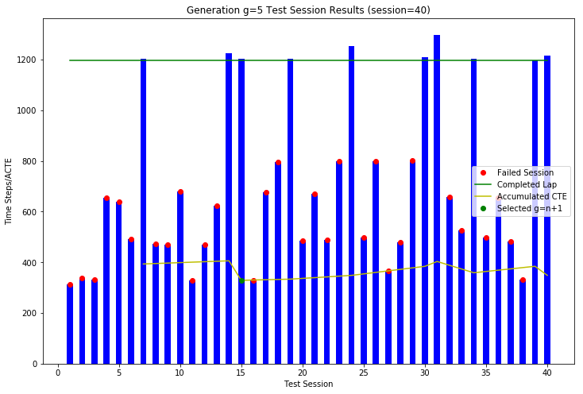
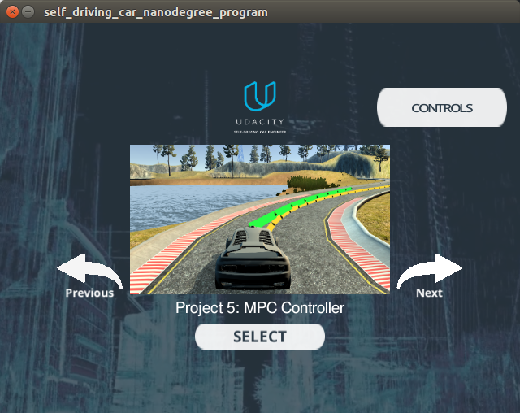
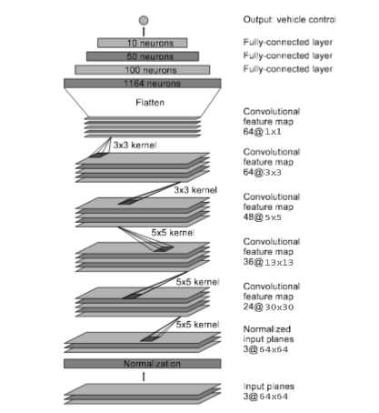
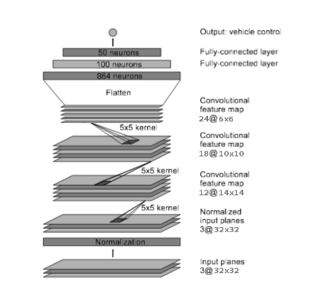
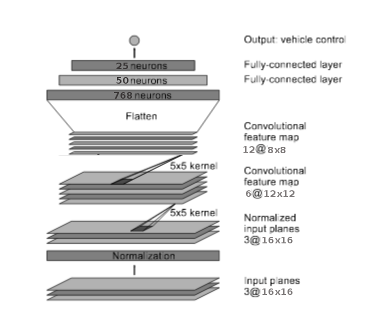
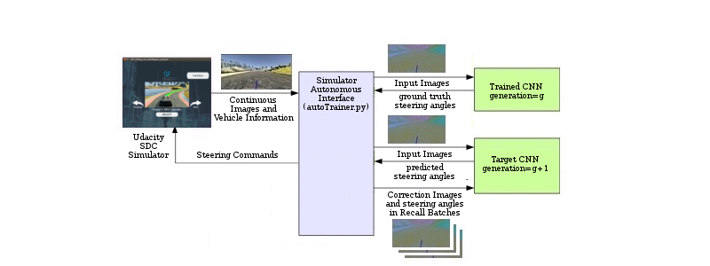
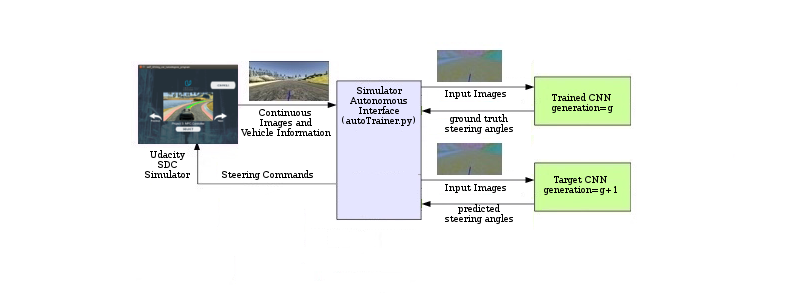
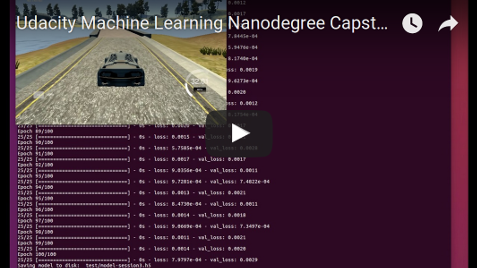
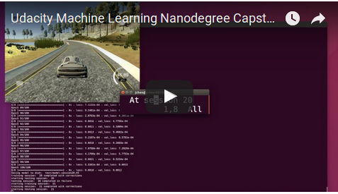

# Udacity MLND Capstone Project
## Teach A Car How to Drive Itself



In this project, we created a trainer with Anaconda, Python 3.5, Keras, Tensorflow, NVIDIA CUDA, Titan X GPU, and Udacity’s Self-Driving Car Simulator to use a previously trained neural network to train a new neural network how to drive a simulated car on the same track as the one for project 3, but this time on its own using real-time image data from the simulator in autonomous mode and reinforcing corrective behavior. This project was inspired by DeepMind: https://deepmind.com/ and their human-level control through Deep Reinforcement Learning: https://deepmind.com/research/dqn/ and their AphaGo training method: https://deepmind.com/research/alphago/.

A detail report of this project can be found in the project PDF: [MLND-Capstone-Project.pdf](./MLND-Capstone-Project.pdf)

## Installation

The Udacity simulator for project 3, when in autonomous mode, will send the vehicles front camera images, throttle/brake combination, and steering angle, but lacks the waypoints, as well as vehicle orientation, for doing the CTE calculations, but we found that for term 2 project 5, Model Predictive Control (MPC), the MPC simulator did have these features, but lack the front camera images that we needed for training the models. But, since the Udacity simulator is open sourced, we can fork a copy and make the modification necessary to include the front camera image. This modification is detailed here: https://github.com/diyjac/self-driving-car-sim/commit/6d047cace632f4ae22681830e9f6163699f8a095, and is available in the github: https://github.com/diyjac/self-driving-car-sim. I have include the binary executables at the following google drive shared link for your evaluation enjoyment:

1. Windows: https://drive.google.com/file/d/0B8uuDpajc_uGVVRYczFyQnE3Rkk/view?usp=sharing
2. MacOS: https://drive.google.com/file/d/0B8uuDpajc_uGTnJvV0RXbjRMcDA/view?usp=sharing
3. Linux: https://drive.google.com/file/d/0B8uuDpajc_uGTld2LXl3VFYzZHc/view?usp=sharing




This project uses python 3.6 installed using Anaconda in Ubuntu Linux for our training system.  Clone the GitHub repository, and use Udacity [CarND-Term1-Starter-Kit](https://github.com/udacity/CarND-Term1-Starter-Kit) to get the most of the dependencies.  In addition, we use NVIDIA CUDA GPU acceleration for Keras/Tensorflow Model Training.  While it is possible to use AWS with GPU and Tensorflow support, we have not tried it.  This article [https://alliseesolutions.wordpress.com/2016/09/08/install-gpu-tensorflow-from-sources-w-ubuntu-16-04-and-cuda-8-0/](https://alliseesolutions.wordpress.com/2016/09/08/install-gpu-tensorflow-from-sources-w-ubuntu-16-04-and-cuda-8-0/) provides a good walk through on how to install CUDA 8.0 and Tensorflow 1.2.  We are using Keras 2.0.5 for creating our NVIDIA and custom steering models.

```
git clone https://github.com/diyjac/MLND-Capstone-Project.git
```

## Usage

autoTrainer is a python based CLI. You list options by using --help:

```bash
$ python autoTrain.py --help
Using TensorFlow backend.
usage: python autoTrain.py [options] gen_n_model gen_n_p_1_model

DIYJAC's Udacity MLND Capstone Project: Automated Behavioral Cloning

positional arguments:
  inmodel               gen0 model or another pre-trained model
  outmodel              gen1 model or another target model

optional arguments:
  -h, --help            show this help message and exit
  --maxrecall MAXRECALL maximum samples to collect for training session,
                        defaults to 500
  --speed SPEED         cruz control speed, defaults to 30
```

**NOTE: The `outmodel` is a directory containing the `model.py` class library that defines the target model.  An example of this file can be found in test/model.py.
The test directory contains a NVIDIA 64x64 Model that is described below in the CNN Model Section.**

To train a test generation, use this sample:

```bash
$ python autoTrain.py gen0/model.h5 test
```

To get the current running status of the training, use the provided Jupyter Notebook: [./visualization/training_visualization.ipynb](./visualization/training_visualization.ipynb)

```bash
$ cd visualization
$ jupyter notebook training_visualization.ipynb
```

After training, you can verify the new target model is working by using the `testdrive.py` script:

```bash
$ python testdrive.py --help
usage: testdrive.py [-h] [--speed SPEED] [--laps LAPS] model [image_folder]

Remote Driving

positional arguments:
  model          Path to model h5 file. Model should be on the same path.
  image_folder   Path to image folder. This is where the images from the run
                 will be saved.

optional arguments:
  -h, --help     show this help message and exit
  --speed SPEED  Cruse Control Speed setting, default 30Mph
  --laps LAPS    Number of laps to drive around the track, default 1 lap
```

Example (assuming that test/model-session11.h5 was selected as the best __ACTE__):

```bash
python testdrive.py test/model-session11.h5
```


## Problem Statement
For Project 3, Udacity has created a car simulator based on the Unity engine that uses game physics to
create a close approximation to real driving, where the students’ are to use Behavioral Cloning to train
the simulated car to drive around a test track. The student’s task are:

1. Collect left, center and right camera images and steering angle data by driving the simulated car
2. Design and create a CNN regression model architecture for learning the steering angle based on
the center camera image
3. Train it to drive the simulated car
4. Test the trained model in the simulator in Autonomous mode.5. Repeat 1-4 until the trained model can drive the simulated car repeatedly on the test track.

But, training in batch mode is tough! Times from step 1 to 3 could take hours, before trying on the
simulator in Autonomous mode and find out:

1. Data collected was not enough
2. Data collected was not the right kind
3. Key areas in the track were not learned correctly by the model
4. Model was not designed or created correctly.

Clearly the data collection, model design, training and testing cycle needs to be faster. The goal of this
project is to design an automated system to iterate the model design, data gathering and training in a
tighter automated loop where successive improved models can be used to train even more advance
models. To accomplish this goal, the tasks involved are the following:

1. Evaluate the current Udacity Self-Driving Car Simulator for the task
2. Design and create the automated training system and its training method
3. Select a trained DNN model as the initial generation (g=0)
4. Select target DNN models for training as the next generation (g+1)
5. Train using the automated training system
6. Test the target DNN model effectiveness
7. Discard target DNN model and repeat 4-6 if it does not meet metrics criteria
8. Repeat 4-7 successively using DNN model generation g to create generation g+1

## CNN Models

We will start off by using our trained NVIDIA model as generation 0 (g=0), and a modified NVIDIA target models in our test as generation 1-3 to see if this successive models can perform well on driving the car around the test lake track. Below are the models used in this evaluation and their generations:

| Model | Description | g |
| :--- | :--- | :---: |
| NVIDIA | Pre-Trained NVIDIA Model from SDC Project 3 | 0 |
| NVIDIA | 64x64 model - no weights | 1 |
| NVIDIA | 64x64 model - no weights | 2 |
| NVIDIA | 64x64 model - no weights | 3 |
| Custom 1 | 32x32 model - no weights | 4 |
| Custom 2 | 16x16 model - no weights | 5 |

### NVIDIA Model with 64x64 input



### Custom 1 Model with 32x32 input



### Custom 2 Model with 16x16 input



## Implementation

As stated before, the goal of this project is to design an automated system to train target convoluted neural networks (CNN) steering models using previously trained CNN models. Below is a diagram of the architecture of the automated system and how the trains the target CNN. It is similar as the one used for our project 3 Agile Trainer (https://github/diyjac/AgileTrainer) where a continuous stream of images is stored into a randomized replay buffer for training batches, but now instead of manual intervention by an human, we use a pre-trained model to handle corrective steering actions. Similar to reinforcement learning, we will have a training period where the majority of the time the target model will just receive training at higher learning rates; however, as time elapse, we will reduce the training and start having the target predict the steering and any mistakes will be corrected by the trained model and added to the target model for training refinement.

### Trainer in Training Mode


### Trainer in Target Testing Mode


Below is an example of the output from the provided Jupyter Notebook: [./visualization/training_visualization.ipynb](./visualization/training_visualization.ipynb).  You can look at a complete process of generations 1 through 5 and the speed training using the completed notebook: [./visualization/sample_data_visualization.ipynb](./visualization/sample_data_visualization.ipynb)

### Mapped Results from generation=5


## Video Sessions
The following are video sessiosn of model generation training.

### AutoTrainer Video Training Session

This video trains a test generation

[](https://www.youtube.com/watch?v=4f21TkZquqo)

### AutoTrainer Video Speed Training Session

This video trained a 40Mph model from a 30Mph trainer model.

[](https://www.youtube.com/watch?v=4f21TkZquqo)


